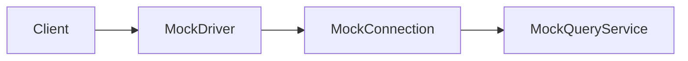

# Skill: Documentation Expert (Functional + Technical)

## Context
Use this skill when the user asks for documentation of features, architecture, or behavior.

This project uses two documentation targets:
- **Functional documentation:** `doc/`
- **Technical documentation:** root `README.md`

## When to Use This Skill
- User asks to document a feature, flow, or use case
- User asks to update technical project documentation
- Code changes require functional impact notes
- API/config/data contracts are added or changed

## Core Mandates
- Keep documentation clear, concise, and easy to scan.
- Avoid dense paragraphs; prefer short sections and bullets.
- Add examples whenever they reduce ambiguity.
- Add simple diagrams when they improve understanding (Mermaid preferred).
- Use tables for property sets, config matrices, or field catalogs.
- Keep functional docs in `doc/` and technical overview in root `README.md`.

## Documentation Routing Rules

### 1) Functional Documentation (`doc/`)
Document:
- User-visible behavior
- Business flows and use cases
- Inputs/outputs and expected outcomes
- Operational examples

Suggested files:
- `doc/functional-overview.md`
- `doc/use-cases.md`
- `doc/flows/<feature-name>.md`

### 2) Technical Documentation (`README.md`)
Document:
- Architecture and module structure
- Build/run instructions
- Integration points and dependencies
- Design decisions and constraints

## Style Rules
- Use short headings and compact sections.
- Prefer bullets over long prose.
- Keep examples minimal but complete.
- Prefer one diagram per concept.
- Update only impacted sections; avoid noisy rewrites.

## Diagram Guidance (Simple, Not Complex)
Use diagrams only when they clarify flow or architecture.

Example flow diagram:

## Table Guidance
Use tables for grouped properties, options, and contracts.

Example property table:

| Property | Type | Required | Default | Description |
|---|---|---|---|---|
| `host` | string | yes | - | Target server host |
| `port` | int | yes | `50051` | gRPC server port |
| `timeoutMs` | int | no | `3000` | Request timeout in ms |

## Legacy vs Modern Example

### Legacy (dense)
"The system connects to a server and then attempts to run queries with several fallback behaviors and there are multiple possible outcomes depending on timeouts and error responses..."

### Modern (concise)
- Connect to `host:port`
- Execute query with `timeoutMs`
- On timeout: return retryable error
- On success: map response to DTO

## Quality Bar
A documentation update is complete when:
- [ ] Functional impact is documented in `doc/`
- [ ] Technical impact is reflected in root `README.md` (if applicable)
- [ ] Examples/diagram/table added where useful
- [ ] Content is concise and non-redundant
- [ ] Paths and commands are accurate

