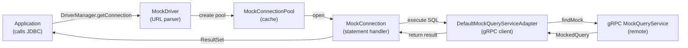

# MockJDBC Foundation

**A JDBC-compatible mock framework for testing SQL-based applications.**

Test your database code without a real database. MockJDBC intercepts JDBC calls and resolves them to mocked responses via gRPC, enabling fast, isolated, deterministic tests.

---

## 📖 Documentation Hub

This document is the **functional reference** for MockJDBC. It covers goals, capabilities, use cases, and core flows.

### Quick Links

| Document | Purpose |
|---|---|
| **[Functional Overview](doc/functional-overview.md)** | High-level goal, capabilities, and actors |
| **[Use Cases](doc/use-cases.md)** | 5 key user scenarios (UC-01..UC-05) |
| **[Query Mocking Flow](doc/flows/query-mocking-flow.md)** | Sequence diagram and request mapping rules |
| **[Technical Architecture](mockjdbc/README.md)** | Module layout, build, properties, stack |

---

## 🎯 What This Project Provides

MockJDBC is a **JDBC driver proxy** that:

1. **Intercepts JDBC calls** — Transparently replaces database calls with mock responses
2. **Resolves SQL queries** — Looks up matching mocked query definitions via gRPC
3. **Supports all statement types** — Plain SQL, Prepared Statements, Callable Statements
4. **Emits execution events** — Logs/audits query execution for observability
5. **Centralizes test data** — Single gRPC service owns all mocked responses

### Core Capabilities

- ✅ **JDBC URL-based configuration** — `jdbc:mock://localhost:50051/?keepAliveTime=30;...`
- ✅ **Prepared statement parameters** — Full support for SQL parameter binding
- ✅ **Callable procedure execution** — Handle stored procedure calls
- ✅ **gRPC-based lookups** — Efficient, language-agnostic query resolution
- ✅ **Event publishing** — Hook into query execution for logging/monitoring
- ✅ **Connection pooling** — Built-in caching by JDBC URL

---

## 🔄 Functional Flow (Happy Path)



### Step-by-Step (UC-02: Plain SQL)

1. **Connect**: `DriverManager.getConnection("jdbc:mock://localhost:50051")`
2. **Execute**: `statement.execute("SELECT id FROM users")`
3. **Lookup**: Adapter sends `QueryLookupRequest` with SQL to gRPC service
4. **Respond**: Service returns `MockedQuery` definition
5. **Return**: Connection delivers mocked results to application

---

## 🔌 Configuration (Connection Properties)

All configuration flows through JDBC connection properties. Set them in the connection URL:

```
jdbc:mock://localhost:50051/?host=localhost&port=50051&keepAliveTime=30&keepAliveTimeUnit=SECONDS
```

| Property | Required | Default | Purpose |
|---|---|---|---|
| `host` | ✅ | - | gRPC server hostname/IP |
| `port` | ✅ | - | gRPC server port |
| `keepAliveTime` | ❌ | `30` | Keep-alive ping interval (seconds) |
| `keepAliveTimeUnit` | ❌ | `SECONDS` | TimeUnit for keep-alive |
| `keepAliveTimeout` | ❌ | `10` | Keep-alive response timeout |
| `keepAliveTimeoutTimeUnit` | ❌ | `SECONDS` | TimeUnit for timeout |
| `idleTimeout` | ❌ | `10` | Channel idle timeout |
| `idleTimeoutTimeUnit` | ❌ | `MINUTES` | TimeUnit for idle |

---

## 📋 Use Cases

See **[Use Cases](doc/use-cases.md)** for full details. Quick summary:

| ID | Scenario | Statement Type |
|---|---|---|
| **UC-01** | Connect to mock JDBC | — |
| **UC-02** | Resolve plain SQL | `Statement` |
| **UC-03** | Resolve with parameters | `PreparedStatement` |
| **UC-04** | Resolve callable | `CallableStatement` |
| **UC-05** | Emit execution events | Any |

---

## 🔀 Query Resolution Sequence

See **[Query Mocking Flow](doc/flows/query-mocking-flow.md)** for detailed sequence diagram.

**Request mapping rules:**

| Statement Type | Request Fields |
|---|---|
| Plain `Statement` | `sql` only |
| `PreparedStatement` | `sql` + `parameters[]` |
| `CallableStatement` | `callSql` + `parameters[]` |

**Failure points:**
- Missing `host` or `port` property
- Invalid `TimeUnit` enum value
- gRPC channel unavailable or timeout
- Service returns no matching mock

---

## ⚙️ Technical Stack

For build, architecture, and module details, see **[Technical Architecture](mockjdbc/README.md)**.

| Component | Version |
|---|---|
| Java | 17 |
| Maven | Multi-module (parent + 3 submodules) |
| gRPC | 1.79.0 |
| Protobuf | 4.34.0 |
| DataSource Proxy | 1.11.0 |
| JUnit | 5.11.3 |

---

## 🏗️ Module Layout

```
mockjdbc/                    # Parent POM (centralized versions)
├── mockjdbc-proxy/          # JDBC event interception & logging
├── mockjdbc-proto/          # gRPC service contracts (Protobuf)
└── mockjdbc-mock/           # MockDriver, connection pool, adapter
```

See **[Technical Architecture](mockjdbc/README.md)** for module responsibilities and build instructions.

---

## 🚀 Quick Start

```bash
# Build
cd mockjdbc
mvn clean verify

# Use in your tests
DriverManager.getConnection("jdbc:mock://localhost:50051/?host=localhost&port=50051");
```

---

## 📚 Related Documentation

- **Functional**: Overview, use cases, flows (in `doc/`)
- **Technical**: Build, architecture, modules (in `mockjdbc/README.md`)
- **Code**: Javadoc comments and skill documentation in `.github/skills/`

---

## 📝 Notes

- This is a **mock/stub framework** for testing, not a proxy for production use
- Connection pooling is per-URL; reuse URLs to benefit from caching
- gRPC service is called **synchronously** (blocking stubs)
- All statement types are supported: plain, prepared, callable

