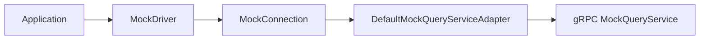
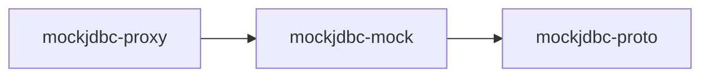

# mockjdbc-foundation

Technical documentation for the MockJDBC project.

## What This Project Provides
- A mock JDBC stack to execute SQL against mocked responses.
- gRPC-based query lookup through generated protobuf contracts.
- Query execution proxy hooks for logging and event listeners.

## Repository Layout

| Path | Purpose |
|---|---|
| `mockjdbc/` | Maven parent project (`packaging=pom`) |
| `mockjdbc/mockjdbc-proxy` | DataSource proxy utilities and query execution events |
| `mockjdbc/mockjdbc-proto` | Protobuf/gRPC contracts and generated stubs |
| `mockjdbc/mockjdbc-mock` | Mock JDBC driver, connection pool, and gRPC query adapter |
| `doc/` | Functional documentation (use cases, flows, expected behavior) |

## Technical Stack

| Area | Value |
|---|---|
| Java | 17 (`maven.compiler.release=17`) |
| Build | Maven multi-module |
| RPC | gRPC (`grpc-bom` 1.79.0) |
| Contracts | Protobuf (`protobuf` 4.34.0) |
| Proxying | `datasource-proxy` 1.11.0 |
| Tests | JUnit Jupiter 5.11.3 |

## Build and Verification

```bash
cd mockjdbc
mvn clean verify
```

## Runtime Architecture (High Level)



## Module Interaction



## Connection Properties (`mockjdbc-mock`)

The adapter reads these keys from JDBC properties:

| Property | Required | Default | Notes |
|---|---|---|---|
| `host` | yes | - | gRPC server host |
| `port` | yes | - | gRPC server port |
| `keepAliveTime` | no | `30` | Keep-alive interval |
| `keepAliveTimeUnit` | no | `SECONDS` | `TimeUnit` enum value |
| `keepAliveTimeout` | no | `10` | Keep-alive timeout |
| `keepAliveTimeoutTimeUnit` | no | `SECONDS` | `TimeUnit` enum value |
| `idleTimeout` | no | `10` | Channel idle timeout |
| `idleTimeoutTimeUnit` | no | `MINUTES` | `TimeUnit` enum value |

## Documentation Rules
- Functional docs live in `doc/`.
- Technical docs live in this root `README.md`.
- Keep docs concise; use bullets, examples, diagrams, and tables when they improve clarity.

## Related Functional Docs
- `doc/functional-overview.md`
- `doc/use-cases.md`
- `doc/flows/query-mocking-flow.md`
