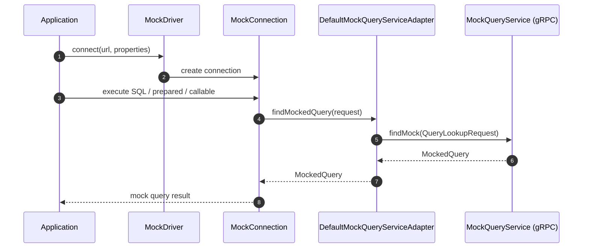

# Flow: Query Mocking

## Scope
This flow describes how SQL is translated into a `MockedQuery` response through the gRPC lookup service.

## Sequence

## Request Mapping Rules

| Statement Type | Request Fields |
|---|---|
| Plain statement | `sql` |
| Prepared statement | `sql`, `parameters[]` |
| Callable statement | `callSql`, `parameters[]` |

## Property Dependencies

| Property | Usage |
|---|---|
| `host` | gRPC target host |
| `port` | gRPC target port |
| `keepAlive*` | Channel keep-alive tuning |
| `idleTimeout*` | Channel idle lifecycle |

## Failure Points
- Missing required property (`host`, `port`).
- Invalid `TimeUnit` value in timeout properties.
- gRPC channel unavailable.
- Service returns error or no matching mock.

## Notes
- Keep-alive and retry are configured in `DefaultMockQueryServiceAdapter`.
- Channel is reused per adapter instance and closed when connection closes.

